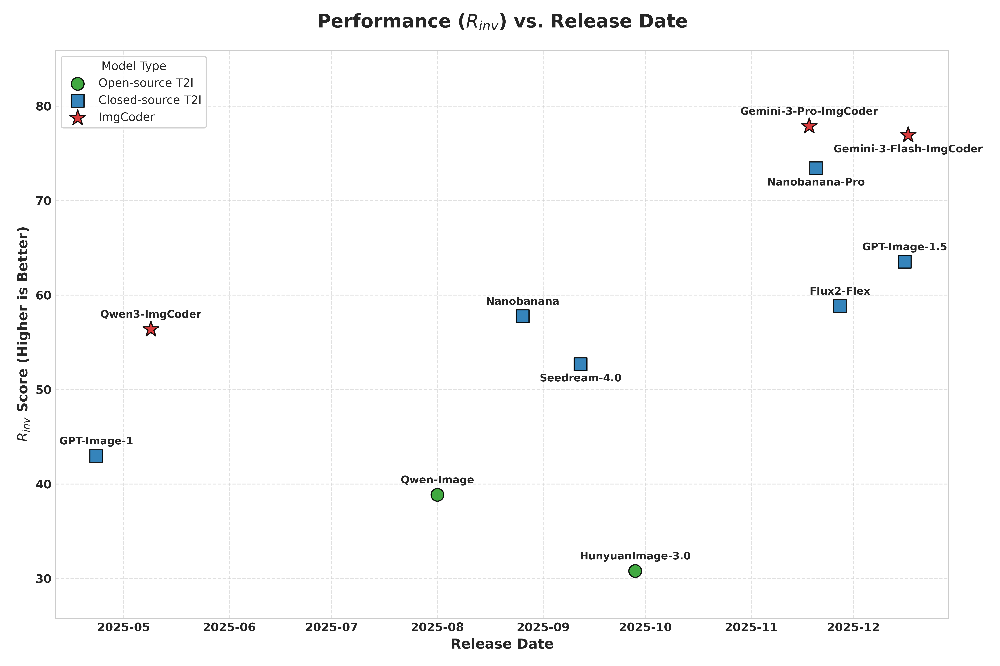

<p align="center">
<h1 align="center">Scientific Image Synthesis: Benchmarking, Methodologies, and Downstream Utility</h1>

<p align="center">
<strong>Honglin Lin</strong><sup>1,2†</sup>, 
<strong>Chonghan Qin</strong><sup>3,2†</sup>, 
<strong>Zheng Liu</strong><sup>4,2</sup>, 
<strong>Qizhi Pei</strong><sup>2</sup>, 
<strong>Yu Li</strong><sup>2</sup>, 
<strong>Zhanping Zhong</strong><sup>1,2</sup>, 
<strong>Xin Gao</strong><sup>1,2</sup>, 
<strong>Yanfeng Wang</strong><sup>1</sup>, 
<strong>Conghui He</strong><sup>2</sup>, 
<strong>Lijun Wu</strong><sup>2*</sup>
</p>

<p align="center">
<sup>1</sup>Shanghai Jiao Tong University &nbsp;&nbsp;
<sup>2</sup>OpenDataLab, Shanghai Artificial Intelligence Laboratory &nbsp;&nbsp;
<sup>3</sup>The University of Hong Kong &nbsp;&nbsp;
<sup>4</sup>Peking University
</p>

<p align="center">
<sup>†</sup>Equal Contribution &nbsp;&nbsp;
<sup>*</sup>Corresponding Author
</p>

<p align="center">
    <a href="https://arxiv.org/abs/2601.17027/"></a>
    <a href="https://github.com/SciGenBench/SciGenBench/blob/main/LICENSE"></a>
    <a href="https://scigenbench.github.io/"></a>
    <a href="https://huggingface.co/collections/J017athan/scigenbench"></a>
    <a href="https://hub.zenoml.com/project/b468f508-6492-40f2-8ff3-9db8db44c1b7/SciGenBench"></a>
</p>

> **SciGenBench** is a benchmark for **scientific image generation**.
> **ImgCoder** enables **logic-driven, verifiable diagrams** via *Understand → Plan → Code*.
> **Better synthetic images → better multimodal reasoning.**

While synthetic data has proven effective for improving scientific reasoning in the text domain, multimodal reasoning remains constrained by the difficulty of synthesizing scientifically rigorous images. Existing Text-to-Image (T2I) models often produce outputs that are visually plausible yet scientifically incorrect, resulting in a persistent visual–logic divergence that limits their value for downstream reasoning.
Motivated by recent advances in next-generation T2I models, we conduct a systematic study of scientific image synthesis across generation paradigms, evaluation, and downstream use. We analyze both direct pixel-based generation and programmatic synthesis, and propose **ImgCoder**, a logic-driven framework that follows an explicit **“understand → plan → code”** workflow to improve structural precision.
To rigorously assess scientific correctness, we introduce **SciGenBench**, which evaluates generated images based on information utility and logical validity. Our evaluation reveals systematic failure modes in pixel-based models and highlights a fundamental expressiveness–precision trade-off.  Finally, we show that fine-tuning Large Multimodal Models (LMMs) on rigorously verified synthetic scientific images yields consistent reasoning gains, with potential scaling trends analogous to the text domain, validating high-fidelity scientific synthesis as a viable path to unlocking massive multimodal reasoning capabilities.

## 🌟 Key Contributions

* **ImgCoder Framework**: A logic-driven programmatic framework decoupling reasoning from rendering to achieve state-of-the-art structural precision.
* **SciGenBench**: A large-scale benchmark with **1.4K problems** across **5 domains** (Math, Physics, Chemistry, Biology, Universal) and **25 image types**, utilizing a hybrid evaluation protocol (LMM-as-Judge + Inverse Quiz Validation) .
* **Systematic Analysis**: We reveal a "Precision-Expressiveness" trade-off between pixel-based and code-based paradigms and categorize 5 systematic failure modes.
* **Downstream Utility**: We prove that high-fidelity synthetic data scales multimodal reasoning capabilities, with performance following a log-linear growth trend.

## 📊 SciGenBench

SciGenBench evaluates scientific image generation on two core dimensions: **Information Utility** (via Inverse Quiz Validation) and **Logical Correctness** (via LMM-as-Judge).

### Taxonomy

The benchmark covers 5 major subjects and 25 fine-grained image types:

* 🧮 **Math**: Geometry (Plane/Solid), Analytic, Set & Probability.
* ⚛️ **Physics**: Mechanics, Fields, Optics, Circuits, Thermodynamics, etc.
* 🧪 **Chemistry**: Molecular Structures, Crystal Structures, Reaction Schemes.
* 🧬 **Biology**: Cell Diagrams, Genetics, Ecological, Molecular Processes.
* 📈 **Universal**: Plots, Charts, Graphs, Tables.

### 📊 Main Results — SciGenBench Leaderboard

**Metric definitions (See paper for full details)**

- **R<sub>inv</sub> (Inverse Validation Rate, ↑)**  
  Whether a generated image alone is sufficient to correctly answer the original scientific question.

- **LMM-as-Judge (0–2, ↑)**  
  - **C&F**: Correctness & Fidelity  
  - **L&P**: Layout & Precision  
  - **R&O**: Readability & Occlusion  
  - **SP**: Scientific Plausibility  
  - **E&R**: Expressiveness & Richness  

- **Standard Metrics (SeePhys real-image subset)**  
  PSNR ↑, SSIM ↑, CLIP ↑, FID ↓

<p align="center">
  
</p>

<p align="center">
  
</p>

## 🚀 ImgCoder: Logic-Driven Synthesis

Unlike pixel-based models that generate images end-to-end, **ImgCoder** adopts a programmatic paradigm:

1. **Understand**: Parses the scientific problem.
2. **Plan**: Explicitly plans image content, layout, labels, and drawing constraints .
3. **Code**: Generates executable code (Python/Matplotlib/TikZ) to render the diagram deterministically.

This approach eliminates hallucinations in structure-heavy tasks (e.g., coordinate systems, circuit topologies).

## 📈 Downstream Utility & Scaling

We explored whether synthetic data improves downstream LMM reasoning. The answer is **Yes**.

### Training Performance

We fine-tuned Qwen3-VL-8B using synthetic data from different sources.

* **Result:** Models trained on higher-quality data (e.g., `Nanobanana-Pro`, `Gemini-ImgCoder`) significantly outperform baselines.
* **Scaling:** Performance scales log-linearly with data size without saturation, similar to text-domain scaling laws.

(Figure: Training Reward Curves and Downstream Accuracy. Higher quality generators (Nano-Banana-Pro) yield higher rewards and test accuracy. )

### Evaluation on Benchmarks (GEO3K & MathVision)

| Model Variant         | GEO3K    | MV       | Average  |
| --------------------- | -------- | -------- | -------- |
| **Nanobanana-Pro**    | **70.7** | 46.1     | **58.4** |
| Nanobanana-Pro (Filt) | 68.7     | **47.7** | 58.2     |
| Gemini-ImgCoder       | 69.1     | 46.9     | 58.0     |
| Qwen-Image (Filt)     | 68.6     | 47.0     | 57.8     |
| Qwen-Image            | 68.2     | 45.9     | 57.1     |
| *Baseline*            | *61.9*   | *39.0*   | *54.5*   |

## 📂 Project Structure

```bash
SciGenBench/
├── data/                       # Datasets and benchmark metadata
│   ├── scigenbench.json        # Full SciGenBench index
│   ├── scigen.json             # SciGen split
│   ├── seephys.json            # SeePhys split
│   └── seephys_images/         # Real scientific images (SeePhys)
│
├── images/                     # Generated images
│   ├── scigen/                 # SciGen generations
│   │   └── {model}/            # One folder per model
│   └── seephys/                # SeePhys generations
│       └── {model}/
│
├── results/                    # Evaluation outputs
│   ├── scigen/
│   │   ├── llm_as_judge/        # LMM-as-Judge scores
│   │   ├── quiz/               # Inverse quiz validation
│   └── seephys/
│       ├── llm_as_judge/
│       ├── quiz/
│       └── t2i/                # Standard image metrics (PSNR, SSIM, FID)
│
├── src/                        # Core source code
│   ├── infer/                  # Image generation
│   │   ├── scigen/             # SciGen generators
│   │   └── seephys/            # SeePhys generators
│   └── eval/                   # Evaluation pipelines
│
├── run.py                      # Unified entry point (generate / eval / leaderboard)
├── requirements.txt
├── README.md
└── LICENSE
```

## 🛠️ Usage

### Installation

```bash
git clone https://github.com/SciGenBench/SciGenBench.git
cd SciGenBench
pip install -r requirements.txt

# Required API keys (set according to models you use)
export OPENAI_API_KEY="your-api-key-here" # For Gemini, GPT Qwen, NanoBanana, Seedream
export TENCENT_SECRET_ID="your-secret-id" # For Hunyuan
export TENCENT_SECRET_KEY="your-secret-key" # For Hunyuan
export BFL_API_KEY="your-bfl-api-key" # For Flux2
```

### Quick Start

```bash
# List available models
python run.py --list-models --dataset scigen

# Generate and evaluate
python run.py --dataset scigen --model gemini-3-pro-imgcoder --mode all

# Generate only
python run.py --dataset scigen --model gemini-3-pro-imgcoder --mode generate

# Evaluate only
python run.py --dataset scigen --model gemini-3-pro-imgcoder --mode eval --metric all
```

### Output

- **Images**: `images/{dataset}/{model}/{id}`
- **Results**: `results/{dataset}/{metric}`

## 📝 Citation

If you find our code, model, or data are useful, please kindly cite our work:

```bibtex
@article{lin2026scientific,
  title={Scientific Image Synthesis: Benchmarking, Methodologies, and Downstream Utility},
  author={Honglin Lin and Chonghan Qin and Zheng Liu and Qizhi Pei and Yu Li and Zhanping Zhong and Xin Gao and Yanfeng Wang and Conghui He and Lijun Wu},
  journal={arXiv preprint arXiv:2601.17027},
  year={2026},
  url={https://arxiv.org/abs/2601.17027/}
}

```
